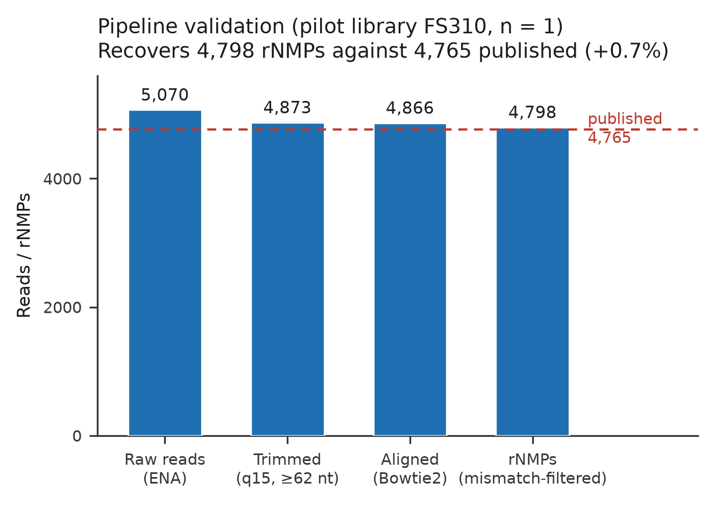
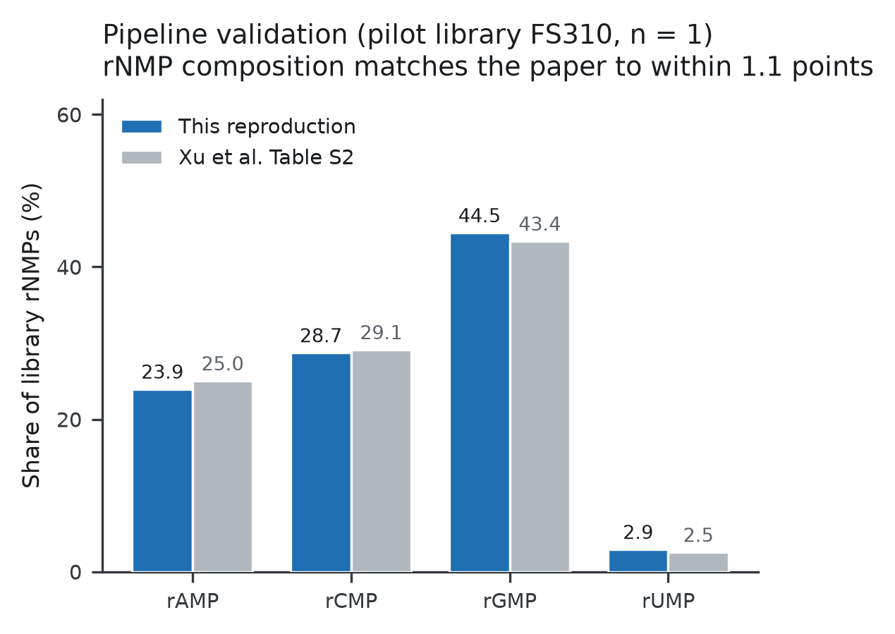
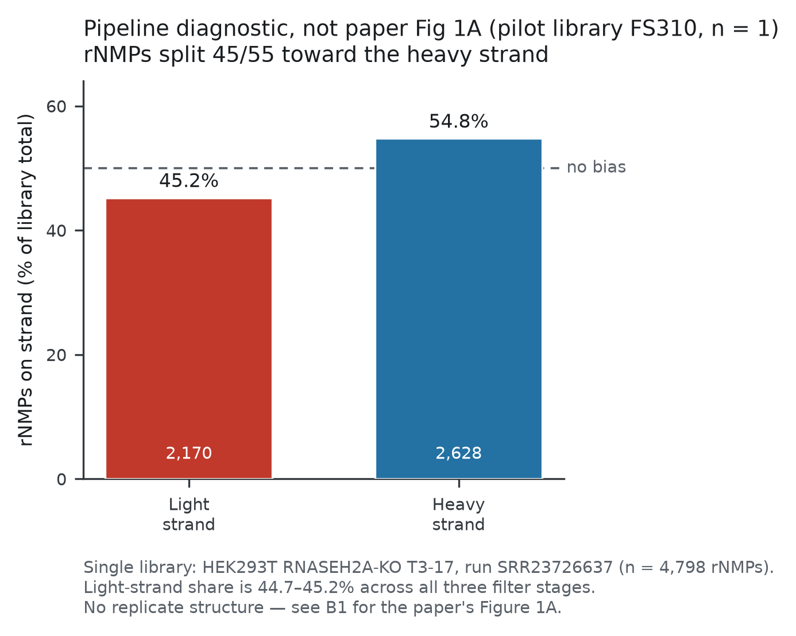
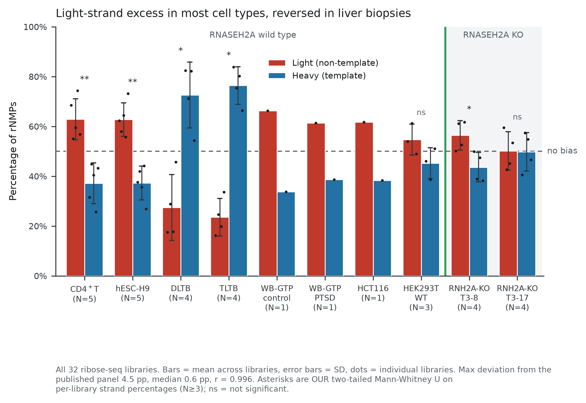
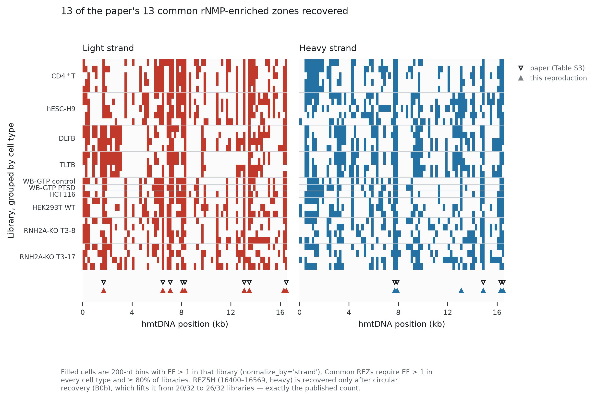
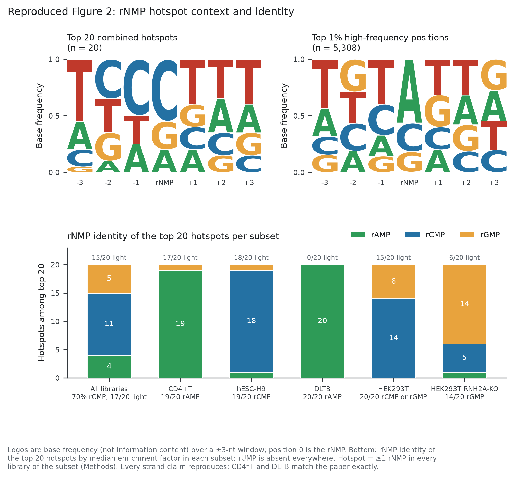
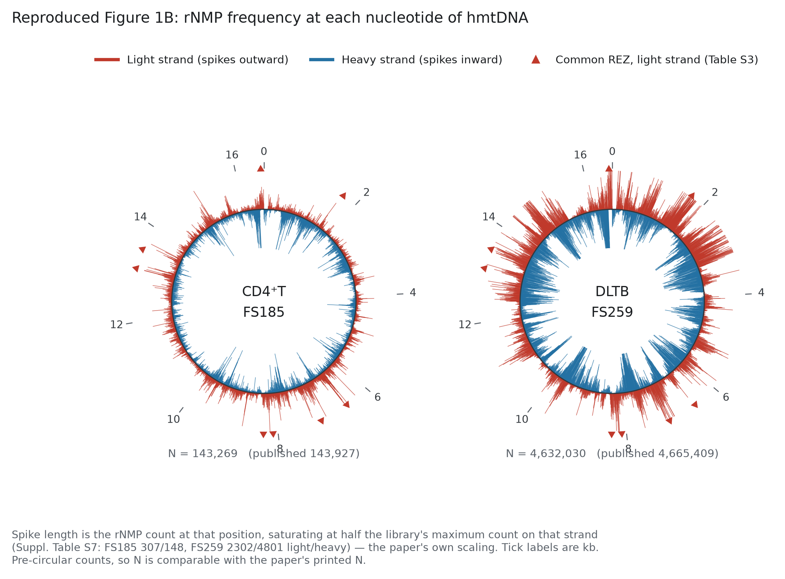
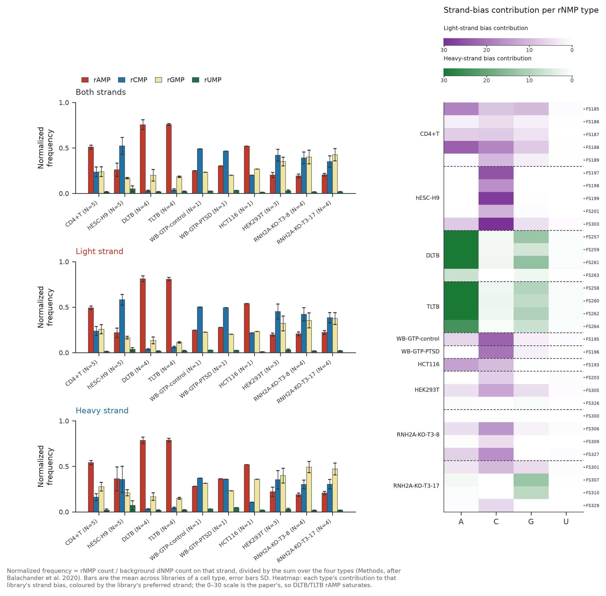
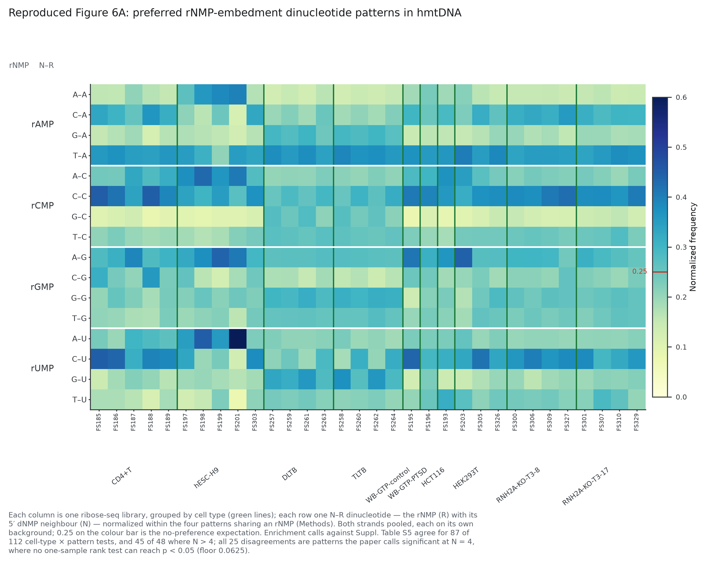
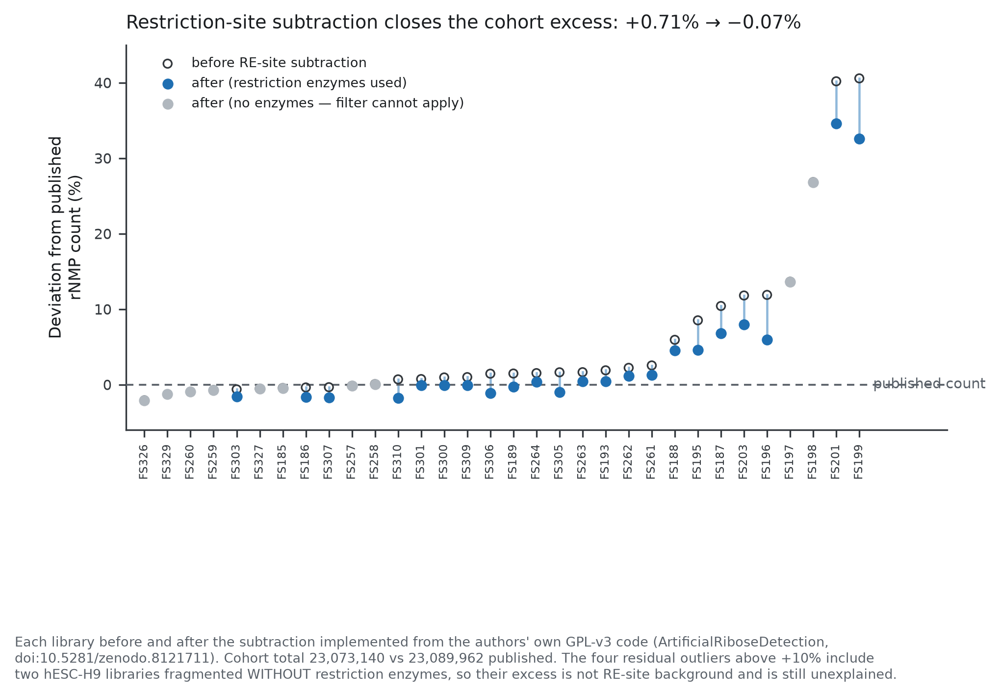

# rNMP mapping in the human mitochondrial genome — a reproduction

## START HERE

This repository reproduces the core analysis of a published paper — rNMP mapping
in the human mitochondrial genome (Xu, Yang *et al.*, *Nucleic Acids Research*
2024) — from the authors' raw ribose-seq reads, and validates it against the
numbers they published. **It recovers 23,073,140 rNMPs against 23,089,962
published, a deviation of −0.07%**, across all 32 libraries. Six of the paper's
figure panels are reproduced, and five findings go beyond reproduction (two
unattainable significance floors, a restriction-site filter reconstructed from
the authors' own code, an internal inconsistency between the paper's own tables,
an SRA metadata error, and one stated percentage that its own supplementary table
does not support). Everything needed to regenerate every figure is committed —
no downloads, no network access. Three commands:

```bash
git init && git add -A && git commit -m "rNMP hmtDNA reproduction"   # 1. version it
conda env create -f envs/rnmp-analysis.yaml                          # 2. build the env
conda activate rnmp-analysis && python -m pytest -q                  #    -> 71 passed
python scripts/execute_notebook.py notebooks/rnmp_hmtdna_reproduction.ipynb
#    -> 32 code cells executed, 10 inline figures, 6 rendered tables  (~10 s)
```

The second environment, `envs/rnmp-pipeline.yaml`, holds the aligners and is only
needed to rebuild the counts from the raw FASTQs (§*Reproducing this*, steps 4–6).
The notebook is the thing to read: [`notebooks/rnmp_hmtdna_reproduction.ipynb`](notebooks/rnmp_hmtdna_reproduction.ipynb).

---

Reproduction of the core ribonucleotide (rNMP) mapping and enrichment analysis of
Xu, Yang *et al.* (*Nucleic Acids Research* 2024), rebuilt from the raw ribose-seq
reads and validated against the numbers the paper itself publishes.

> Xu P, Yang T, Kundnani DL, *et al.* **Light-strand bias and enriched zones of
> embedded ribonucleotides are associated with DNA replication and transcription
> in the human-mitochondrial genome.** *Nucleic Acids Research* 2024;52(3):1207–1225.
> [doi:10.1093/nar/gkad1204](https://doi.org/10.1093/nar/gkad1204)

### Headline

**23,073,140 rNMPs recovered against 23,089,962 published — a deviation of -0.07%**,
across all 32 ribose-seq libraries of BioProject PRJNA941970, from FASTQ to
figures. Six of the paper's panels reproduce, 23 of 32 libraries land within 3% of
their own published count, and 13/13 published rNMP-enriched zones are recovered at
exact bin indices.

**Start here:** [`notebooks/rnmp_hmtdna_reproduction.ipynb`](notebooks/rnmp_hmtdna_reproduction.ipynb)
— the driving notebook, every figure rendered inline, executes top to bottom with
no manual steps.

---

## Reproduction at a glance

| Paper panel | This repo | Validated against | Result |
|---|---|---|---|
| **Fig 1A** strand bias by cell type | `figures/fig1A_strand_bias_by_celltype.png` | digitized published panel | max deviation **4.49 pp**, median 0.63 pp, r = 0.996 |
| **Fig 1B** per-nucleotide frequency | `figures/fig1B_rnmp_frequency_circular.png` | Table S7 maxima; printed panel N | totals **143,269 vs 143,927** and **4,632,030 vs 4,665,409** |
| **Fig 1C** rNMP-enriched zones | `figures/fig1C_rez.png` | Table S3 (13 common REZs) | **13/13 recovered**, 10/13 at the exact library count |
| **Fig 2** hotspots + sequence logos | `figures/fig2_hotspots.png` | Table S4 (48 positions × 32 libraries) | **84.3% of 1,536 counts identical integers**, r = 0.9948 |
| **Fig 5** composition + bias contribution | `figures/fig5_composition.png` | Table S2 composition; Methods formulas | every dominant-type claim reproduces |
| **Fig 6A** NR dinucleotide patterns | `figures/fig6A_dinucleotide.png` | Table S5 (112 significance tests) | **87/112 calls agree**; 45/48 where N > 4 |

Supporting: `figures/fig_re_filter_effect.png` (restriction-site subtraction, per
library) and three `figA*` pilot-validation panels. Every number above is written
by the notebook into `results/tables/`, not transcribed by hand.

---

## Objective

Ribonucleotides are the most common non-canonical nucleotide embedded in DNA. In
human mitochondrial DNA (hmtDNA) they are not repaired, so where they sit is a
record of how the genome was replicated and transcribed. Xu *et al.* mapped them
genome-wide across ten cell types and reported three things: a light-strand bias,
200-nt enriched zones (REZs), and single-nucleotide hotspots whose identity varies
by cell type.

This repository asks whether those results follow from the deposited data. It is
not a reimplementation of their code — it is an independent path from the same
FASTQs to the same panels, using the authors' own supplementary tables as the
check at every step. Where the two disagree, the disagreement is the result
(see *Findings beyond reproduction*).

## Data

| Source | Accession | What | Size |
|---|---|---|---|
| Ribose-seq libraries | **PRJNA941970**, 32 runs | the paper's own data, 10 cell types | ~747 MB |
| Reference | GRCh38 **chrM** (16,569 nt) | Ensembl 108, plus a rotated copy for circular recovery | 17 kB |
| Supplementary tables | `gkad1204_supplemental_files.zip` | S1–S7, parsed into `data/external/*.tsv` | 8.2 MB |
| Authors' filter code | [`xph9876/ArtificialRiboseDetection`](https://github.com/xph9876/ArtificialRiboseDetection) (GPL v3, [doi:10.5281/zenodo.8121711](https://doi.org/10.5281/zenodo.8121711)) | restriction-site background removal | — |

Two retrieval notes, both handled in `scripts/`:

- **Reads come from ENA, not `prefetch`.** NCBI's SDL name resolver is not
  reachable from a restricted network; ENA mirrors the same runs as gzipped FASTQ
  over plain HTTPS with a published md5, which the scripts verify. `prefetch` is
  kept as a fallback.
- **The deposited reads are not raw.** They are already adapter-demultiplexed and
  UMI-extracted — no 3-mer dominates read positions 7–9 (top is 2.6%) and 99.8% of
  untrimmed reads align to chrM. So `barcode`/`pattern` are deliberately omitted
  from the Ribose-Map config; setting them yields an empty FASTQ. PCR-duplicate
  collapse is therefore not possible on these files. `docs/dataset_notes.md` §6.

## Methods & Results

Pipeline: ENA fetch (md5-verified) → Trim Galore `-q 15 --length 62` → Bowtie 2 →
Ribose-Map Alignment + Coordinate modules (pinned commit `fff581b`) →
reference-mismatch filter → restriction-site subtraction → circular recovery.
Formulas (PPB, enrichment factor, normalized frequency, strand-bias contribution)
are transcribed from the Methods into `src/rnmp/metrics.py`, with the Methods text
quoted in each docstring and 71 tests pinning them.

### Phase A — Pipeline validation (pilot library, n = 1)





**Result.** FS310, the study's smallest library, yields **4,798 rNMPs against
4,765 published (+0.7%)**, with composition within 1.1 percentage points of
Table S2. Labelled as validation, not as a result: n = 1 and no replicate
structure. The light/heavy split moves under 0.6 pp across all three filter
stages, so it does not hinge on any single filter.

### Phase B1 — Strand bias across cell types (Figure 1A)



**Result.** Reproduced with **max deviation 4.49 pp** (hESC-H9), median
0.63 pp, r = 0.996 across the ten cell types. The light-strand excess holds in
most cell types but **reverses in both liver biopsy sets** — DLTB at 27.4% light,
TLTB at 23.6% — which the paper's title does not say and its own panel also shows.

### Phase B2 — rNMP-enriched zones (Figure 1C)



**Result.** **All 13/13 published common REZs recovered**, 10/13 at the exact
published library count (total absolute deviation across the 13 zones: 5
libraries). REZ5H requires circular recovery and lands at exactly the published
26/32 — see *Findings*.

### Phase B3 — Hotspots and sequence context (Figure 2)



**Result.** Of 1,536 published enrichment values (48 positions × 32 libraries),
**84.3% of the underlying counts are identical integers** and r = 0.9948.
Substituting the published library totals for ours drops the median enrichment
deviation to **0.000%**, which localises the residual to the denominator. Two
per-cell-type composition claims (HEK293T 20/20 rCMP-or-rGMP; RNH2A-KO 14/20
rGMP) match **exactly**; every strand-preference claim reproduces.

### Phase B4 — Per-nucleotide frequency (Figure 1B)



**Result.** Both circular panels reproduce, scaled as the caption specifies — a
full-height spike is *half* the library's maximum count on that strand, from
Table S7. Panel identity is confirmed by the totals sitting beside the paper's own
printed N: **143,269 vs 143,927** (FS185) and **4,632,030 vs 4,665,409** (FS259).
A visual reproduction, and labelled as one: no per-position values are published.

### Phase B5 — Composition and strand-bias contribution (Figure 5)



**Result.** Every dominant-type claim reproduces: rAMP for the liver biopsies
(0.756 DLTB, 0.757 TLTB), rCMP for hESC-H9 (0.522) and both whole-blood
samples, rGMP for both RNASEH2A knockouts (0.40, 0.426 — the cohort's highest).
rUMP is minor everywhere (0.013–0.051). Panel C reproduces the paper's striking
structure: the contribution heatmap is **essentially one column per cell type**, so
a cell type's strand bias is carried by a single nucleotide rather than a general
excess.

### Phase B6 — Dinucleotide patterns (Figure 6A)



**Result.** **C–C is the most enriched pattern for rCMP in nearly every library**
(mean 0.352 against the 0.25 no-preference expectation), with T–A for rAMP, A–G for
rGMP and C–U for rUMP. Enrichment calls agree with Table S5 for **87 of 112**
cell-type × pattern tests, and **45 of 48** wherever the group has more than four
libraries — see *Findings* for the other 25.

---

## Findings beyond reproduction

Five results that are not restatements of the paper. Ordered by how well each is
evidenced, strongest first.

### 1. Two independently confirmed unattainable significance floors

Two separate panels report p-values below what their stated test can produce at
their stated group sizes. Both bottom out at **N = 4**.

| Panel | Paper reports | Smallest attainable one-tailed p |
|---|---|---|
| **Fig 1A** stars (hESC-H9 N=5, TLTB N=4) | `****` i.e. p < 0.0001 | 0.0090 at N=5, 0.0209 at N=4 — *any* Mann–Whitney variant |
| **Table S5** dinucleotide enrichment (N=4 groups) | p = 0.0105 | 0.0625 (Wilcoxon signed-rank) or 0.2 (Mann–Whitney vs a constant, as the Methods state) |

**Evidence.** For Fig 1A, reaching p < 0.0001 needs n ≥ 11 per group and
p < 0.00001 needs n ≥ 14; the largest cell type here has 5. The paper's
*non*-significant calls are consistent with an exact test (HEK293T at N=3 shows
`ns`, where the uncorrected approximation would print `*`), so the floor is not a
test-variant ambiguity. For Table S5, all 25 disagreements run one way — the paper
calls significance, this reproduction does not — and 22 are at N = 4. Our
frequencies at those cells sit just above 0.25 (DLTB T–A at 0.364), i.e. exactly
where a low-powered test should fail to resolve them, which is evidence that the
frequencies are not the problem.
→ `docs/dataset_notes.md` §10, §18; `results/tables/fig6A_nr_significance_vs_paper.csv`

### 2. The restriction-site filter, ported and validated against the authors' own code

The rule is **far narrower than masking whole recognition sites**. For each match
of a recognition pattern it takes the site midpoint and masks exactly two
positions, split by strand: one class removed unconditionally, the other only when
the read carries a non-templated dA tail.



**Evidence.** The port was verified by running the authors' own `re_build()`
directly on GRCh38 chrM — **identical masked position sets for all 18 enzymes**
used in the study. Applied across the cohort it removes 153,767 + 26,076 rNMPs
and closes the cohort deviation from +0.71% to **-0.07%**, with mean composition
deviation falling from 5.11 to 2.97 pp. A consistency check the filter must
pass, and does: the mask covers **0 of 1,056** (published-hotspot, library) pairs —
required, since the authors filtered before calling hotspots.
→ `src/rnmp/re_sites.py` (GPL v3, derived work), `tests/test_re_sites.py`, §8

### 3. The paper's own tables come from two different count sets

Circular recovery is **required** by the REZ analysis and **contradicted** by the
library totals, so the two cannot describe one count set.

**Evidence.** Recovering the 205,507 junction-spanning reads adds 184,035 rNMPs and
lifts REZ5H from 20/32 libraries to **exactly the published 26/32**, leaving all
twelve other zones unchanged. The same reads move **22 of 32** library totals
*away* from Table S2 (-0.07% → +0.72%). Table S2's counts therefore exclude
circularly-recovered reads while the REZ analysis includes them. This repo keeps
both count files and each figure states which it uses; tuning which reads to
recover so both would agree was rejected as fitting to the answer.
→ `results/coordinates/per_position_counts_refiltered.csv.gz` and `per_position_counts_circular.csv.gz`, §16

### 4. SRA mislabels a library

**Evidence.** Run **SRR23726642** (`FS303`) is deposited as `HEK293T-WT` but
belongs to **hESC-H9** per Tables S2 and S4. Figure 1A's own N values settle it
(hESC-H9 N = 5, HEK293T N = 3) — only the Table S2 assignment produces those
counts. `config/samples_xu2024.tsv` therefore derives cell type from Table S2, not
from SRA metadata. Uncorrected, this silently moves one library between a
five-library and a three-library group.
→ `config/samples_xu2024.tsv`, §7

### 5. The stated "70% of common hotspots are rCMP" is not supported by Table S4

**Evidence.** The paper's own 48-row Table S4 gives **66.7%** (32/48). This
reproduction's 51-position set gives 64.7% (33/51); the 46 positions shared with
Table S4 give **69.6%** (32/46), which is the only slicing that rounds to 70%. The
claim is confirmed in substance — rCMP is clearly the dominant hotspot identity —
but the exact figure does not follow from the paper's own supplementary table.
→ `results/tables/fig2_claim_verdicts.csv`, §12

---

## Discussion

The reproduction succeeds at the level that matters for the paper's conclusions:
light-strand bias, REZ locations, hotspot identity, composition and dinucleotide
preference all come out of the deposited data. Three of the paper's quantitative
claims match *exactly* rather than approximately — 84.3% of 1,536 published
enrichment counts are identical integers, REZ5H lands on its published library
count, and two per-cell-type hotspot composition claims are exact after the
restriction-site filter. That level of agreement is only reachable because the
authors published per-library supplementary tables; it would not have been
possible from the figures alone.

What the reproduction adds is a map of where the published record is internally
inconsistent, and the most useful methodological result is a negative one. An
early version of this analysis read the near-perfect correlation between a
library's count deviation and its hotspot enrichment deviation (r = −0.995) as
evidence of a single cause. It is not: whenever the numerator agrees, that
correlation is an **algebraic identity**, reproduced here with zero residual
across all 32 libraries. It localises error to the denominator and says nothing
about cause, and it cannot fall while any library total deviates. The correction
is recorded in the repo (§10) because the wrong version is the more tempting
reading.

## Limitations

- **The hESC-H9 excess is unexplained.** Four libraries remain above +10% after
  every filter and all four are hESC-H9. Two of them (FS197, FS198) were
  fragmented with dsDNA Fragmentase alone and used **no restriction enzymes**, so
  the filter removes exactly zero rNMPs from each, yet they still recover 13.6%
  and 26.8% more rNMPs than published. This is a different mechanism from anything
  in this repository and is scoped as open, not folded into finding 2. Every
  hESC-H9 aggregate here carries a wider error bar than the other nine cell types.
  → §14
- **Two published hotspots are unreachable.** (+, 7018) and (−, 14923) have *no
  aligned read at all* in the library that fails them, while the paper's
  enrichment inverts to 1 and 5 rNMPs. Explained by neither circular recovery
  (both sit >1,600 nt from the junction) nor the restriction-site filter (which
  only removes). Cause is upstream of every filter. → §13
- **No PCR-duplicate collapse.** The deposited reads are already UMI-extracted, so
  `umi_tools dedup` cannot run. Counts are read counts, not unique-molecule counts.
- **Figure 1C is rendered as a raster, not as the paper's per-library rings.** A
  rendering difference, not a quantitative one; the per-library REZ calls are the
  validated object.
- **The strand-bias contribution scale is ambiguous.** The paper's colour scale
  runs 0–30; under the Methods as written the largest per-library contribution
  here is 55.0, so those cells saturate. The formula is internally exact (each
  library's four contributions sum to its bias level to floating-point precision),
  so the discrepancy is in the scale. → §17
- **Not assessed:** distributional diagnostics for the Mann–Whitney tests; which
  test produces p = 0.0105 at N = 4; whether the hESC-H9 excess is a
  nucleotide-pool, sample-quality or alignment effect. All three need the authors'
  per-library logs or analysis scripts.
- **Not reproduced:** Figure 6B (trinucleotides) and Figures 3, 4 and 7.
- **The Berglund *et al.* 2017 extension is scoped but not run.** → §5

## Reproducing this

```bash
# 1. environments
conda env create -f envs/rnmp-analysis.yaml     # figures, metrics, notebook
conda env create -f envs/rnmp-pipeline.yaml     # aligners (only for step 3-4)

# 2. formula tests -- no data needed, ~1 s
conda activate rnmp-analysis && python -m pytest -q
#   71 passed

# 3. figures and tables from the shipped coordinates -- no download, ~10 s
python scripts/execute_notebook.py notebooks/rnmp_hmtdna_reproduction.ipynb
#   32 code cells executed, 10 inline figures, 6 rendered tables

# ---- optional: rebuild the coordinates from raw reads ----
# 4. reference: GRCh38 chrM, Bowtie 2 index, rotated copy, pinned Ribose-Map
conda activate rnmp-pipeline && bash scripts/00_setup_reference.sh

# 5. one library end-to-end (~1 min, 65 kB download)
bash scripts/run_library.sh SRR23726637 FS310

# 6. all 32 libraries (~747 MB, hours)
bash scripts/run_all_libraries.sh
python scripts/export_coordinates.py      # -> per_position_counts.csv.gz
python scripts/filter_re_sites.py         # -> ..._refiltered.csv.gz
python scripts/04_circularize.py          # -> ..._circular.csv.gz
```

Steps 1–3 need no network access and no raw reads. The repository commits the
boundary between the expensive and cheap halves of the pipeline:

- `results/coordinates/*.csv.gz` — both per-position count sets (3.4 MB gzipped)
- `results/tables/*.csv` — the 17 validated result tables
- `data/reference/chrM.fa` and the rotated copy (20 kB each)
- the **pilot library's alignment and coordinate BEDs**, gzipped (192 kB), so that
  Phase A actually executes rather than being described

Steps 4–6 rebuild all of that from the FASTQs. The 11 GB of per-library SAM/BED
intermediates and the Bowtie 2 index are not committed; both are regenerated by
those steps.

**Verified as a fresh clone.** The above was checked by extracting the repository
into an empty directory, deleting everything `.gitignore` excludes (so only what
a `git clone` delivers remains), building the analysis environment from scratch,
and running steps 2–3 with no manual intervention: **94 files, 9.0 MB, 71 tests
pass**, and the notebook executes **32 code cells, 10 inline figures, 6 rendered
tables**, regenerating all ten PNGs. Seven defects were found and fixed by
that test. The two that would have made the repo look broken to anyone but its author:
the notebook resolved its root as `cwd.parent`, so it only ran from `notebooks/`;
and `.gitignore` excluded `results/**` and `data/reference/**` wholesale, so a
clone contained none of the inputs above. `docs/dataset_notes.md` §19 lists all seven.

**Note on the notebook.** It is executed by `scripts/execute_notebook.py` rather
than `jupyter nbconvert`, because a Jupyter kernel cannot bind a socket in a
sandboxed environment. The script `exec`s each cell in-process and writes outputs
back into the `.ipynb`, so the committed notebook carries its figures and tables.
`jupyter lab` works normally for interactive use.

### Layout

```
envs/          two conda environments, pinned and platform-tested
config/        samples_xu2024.tsv (from Table S2, not SRA), params.yaml
data/external/ Tables S1-S5, S7 parsed to TSV; the authors' enzyme list
data/reference/chrM.fa, the rotated copy, Bowtie 2 index, pinned commit
src/rnmp/      metrics.py (formulas) | composition.py | re_sites.py (GPL v3)
               pipeline.py | plotstyle.py
scripts/       setup, download, per-library driver, cohort sweep, filters,
               circular recovery, notebook executor
notebooks/     rnmp_hmtdna_reproduction.ipynb  <- the driver
figures/       10 rendered panels
results/       coordinates/ (two count sets) and tables/ (17 CSVs)
tests/         71 tests: formulas, published values, port fidelity, conventions
docs/          dataset_notes.md -- 18 sections of provenance and deviations
```

### Licence

Analysis code in this repository is MIT. **`src/rnmp/re_sites.py` and
`data/external/res_all.list` are GPL v3**, as derived works of
`xph9876/ArtificialRiboseDetection`; that file carries the notice. The paper is
CC-BY.
